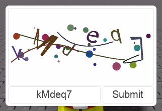
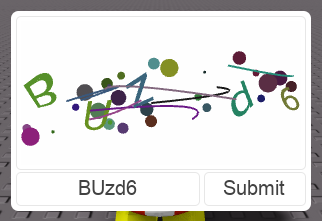
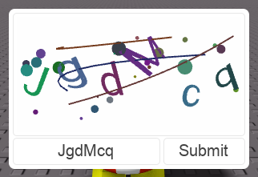

# rbx-captcha
A module for creating captchas in Roblox. This is a WIP.

## Fonts

No pre-setup fonts are provided in this repository. A python script to generate the necessary json files in blender is provided [here](lune/convertfont.py). Once a json file is generated you can use the lune script found [here](lune/pkgfont.luau) to generate `.rbxm` models that can be used with this module.

## Implementation

This module creates a captcha-like image out of primitives and then provides that model to the client. In the future it would be nice to do further work either with CSG or new API to attempt to hide the vertices / shape types of the primitives.

## Examples

